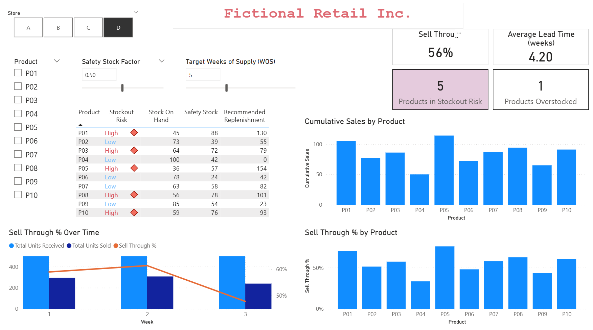
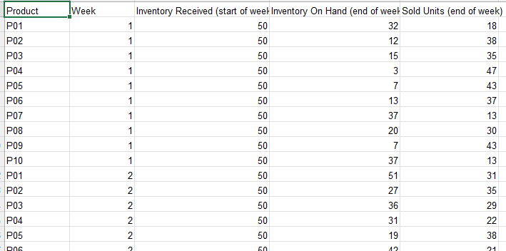
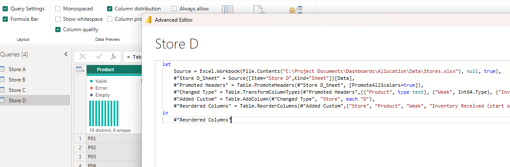

# Allocation Dashboard for Retail

## Objective
This is a Power BI dashboard built from synthetic data to demonstrate KPIs used for determining inventory allocations and replenishment strategy.



**How to view**  
Viewing the interactive dashboard requires Power BI Desktop. It can be viewed in two ways:  
1) By downloading this project and opening the [.pbix report](./Allocation.pbix) file 
2) By opening the [.pbit report template](Allocation.pbit) and manually specifying the paths to the two .xlsx sample data files.
 
## Data Sources

The [Stores.xlsx](./data/Stores.xlsx) file has inventory data for 10 products in four stores recorded in separate sheets.  

The stores are labelled A, B, C, and D and the product identifiers span from P01 through P10. The inventory is tracked on a weekly basis. The weeks are recorded in whole number increments.

The [Product Lead Times.xlsx](./data/Product%20Lead%20Times.xlsx) file has the lead time in weeks per product and store to support calculation of safety stock.




## Data Transformations

Upon loading the stores data file, the information from all stores is concatenated to single fact table. An additional store column is added as the identifier for stores before the transformation. 



## Data Modeling and Relationships

Two dimension tables were extracted from the data sources - Product and Store. 
The inventory data and lead times are treated as fact tables and a star schema is created with one-many relationships from dimension to fact tables.


## Inputs and Parameters

Store Selection     - Single-select   
Product Selection   - Multi-select    
Stock Safety Factor - Range slider (0-1) in increments of 0.1    
Week Over Sales     - Range slider (1-10) in increments of 1

## Metrics

The dashboard tracks the following supply chain allocation metrics.  
The next section shows the actual DAX calcuations.

 $$ \text{Sell Through \%} = \frac{\text{Units Sold}}{\text{Units Received or On Hand}} $$
    
$$ \text{Weeks of Supply} = \frac{\text{Inventory OH}}{\text{Average Weekly Sales }} $$

$$ \text{Safety stock} = (\text{Lead Time in weeks} \times \text{Weekly Sales}) \times \text{Safety Factor} $$

$$Replenishment = (\text{Target WOS} \times AWS) - \text{On Hand}$$

## DAX Measures

The following measures were created for calculations for visuals and KPIs:

```dax
Avg Weekly Sales = 
CALCULATE(
    AVERAGE(FactInventory[Sold Units (end of week)]),
    FILTER(
        ALLSELECTED(
            FactInventory[Store], 
            FactInventory[Product], 
            FactInventory[Week]
            ), 
        FactInventory[Week] <= MAX(FactInventory[Week])
    )
)
```

```dax
Current Units On Hand = 
CALCULATE(
    SUM(FactInventory[Inventory On Hand (end of week)]),
    FactInventory[Week] = MAX(FactInventory[Week])
)
```

```dax
Products in Stockout Risk = 
VAR InRisk =
    COUNTROWS(
        FILTER(
            ADDCOLUMNS(
                DimProduct,
                "stockout risk", [IsStockoutRisk]
            ), 
        [stockout risk] = TRUE()
    )
)
RETURN IF(ISBLANK(InRisk), 0, InRisk)
```


```dax
Recommended Replenishment = 
VAR Replenishment_Units = ('Target Week Over Sales (WOS)'[Target Week Over Sales (WOS) Value] * [Avg Weekly Sales]) - [Current Units On Hand]

RETURN 
IF(Replenishment_Units > 0, Replenishment_Units, 0)
```

```dax
Sell Through % = (
    DIVIDE(
        [Total Units Sold],
        [Total Units Received],
        0
    )
)
```

```dax
Safety Stock = 
[Lead Time] * [Avg Weekly Sales] * 'Safety Stock Factor'[Safety Stock Factor Value]
```

```dax
IsStockoutRisk = [Current Units On Hand] <= [Safety Stock]
```

```dax
Stockout Risk = IF([IsStockoutRisk], "High", "Low")
```

```dax
Is Overstocked = [Recommended Replenishment] < ( 0.25 * [Current Units On Hand])
```

```dax
Products Overstocked = 
VAR Overstocked = 
    COUNTROWS(
        FILTER(
            ADDCOLUMNS(
                DimProduct,
                "overstocked", [Is Overstocked]
            ),
        [overstocked] = TRUE()
    )
)
RETURN IF(ISBLANK(Overstocked), 0, Overstocked)
```

```dax
Total Units Received = SUM(FactInventory[Inventory Received (start of week)])
```

```dax
Total Units Sold = SUM(FactInventory[Sold Units (end of week)])
```

```dax
Average Lead Time = AVERAGE('Lead Times'[Lead Time (in weeks)])
```

```dax
Cumulative Sales = SUM(FactInventory[Sold Units (end of week)])
```

```dax
Lead Time = MAX('Lead Times'[Lead Time (in weeks)])
```


### Future Wishlist
- Ranking the stores based on sell-through %.
- Show stock-to-sales ratio to show product supply relative to current period sales.
- Show inventory turns per year to measure efficiency.
- Use dates for weeks with time intelligence DAX measures.

